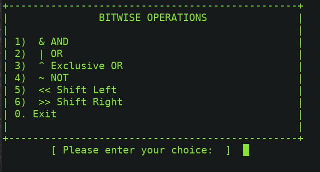
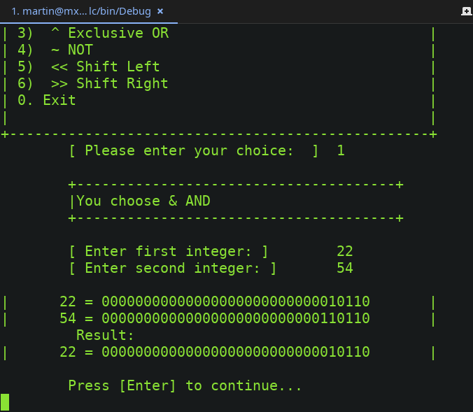
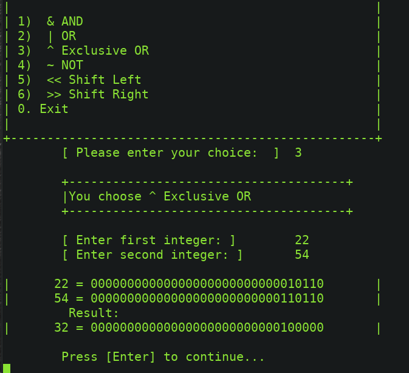
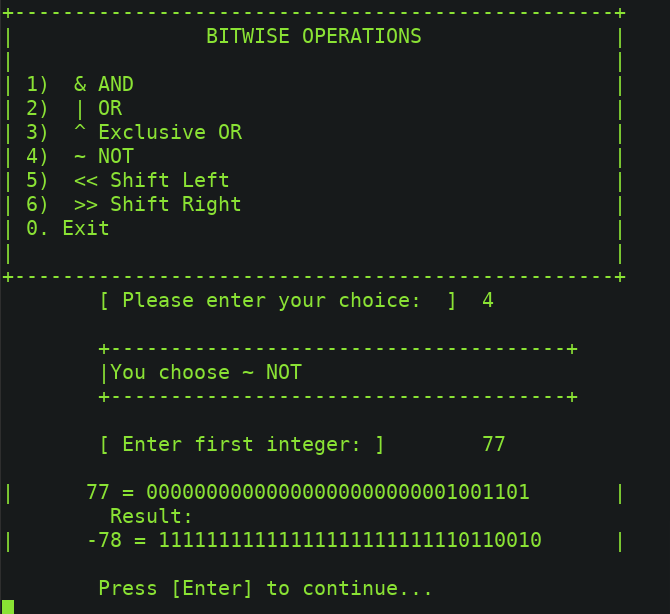

# Operaciones Bitwise (a nivel de bits) con C#

Además de los operadores condicionales lógicos y de relación C# cuenta con operadores a nivel de bits (bitwise operators o logical operators) que permiten realizar operaciones con las representaciones binarias de las variables que internamente utiliza la computadora, esto es útil en ciertos casos donde se requiere interactuar directamente con el hardware o utilizar  una variable entera como un arreglo de bits donde por ejemplo un tipo short representaría un arreglo de bits con una longitud de 16 valores y cada bit podría ser utilizado como si fuera un valor booleano 1 igual true y 0 igual a false.
    

    

    Los tipos de datos donde usualmente aplican estos operadores son: los numéricos y las enumeraciones.
    

    

    La siguiente tabla muestra los tipos numéricos, su longitud en bytes y su valor en decimal.

    

        

 
    

        Así por ejemplo si tenemos valores decimales representados en variables byte  (8 bits hasta 255 en decimal)
          byte a = 22;
         byte b = 33;
          
        Internamente su representación en binario es:
          22 = 00010110
         33 = 00100001  
        si utilizamos variables de tipo short (16 bits hasta 65,535)   
        short c = 54; 
        short d = 22;  
        su representación en binario es: 
         54  = 110110 
        22 = 10110  
        Así con cada tipo numérico siempre agrupando las cadenas de bits de 8 en 8. La siguiente tabla muestra los operadores bitwise, su significado y su resultado. 
    

    

        

 
    
Al ejecutarlo veremos los siguientes resultados:
 

		    

 
    

 
    

 
    

 
